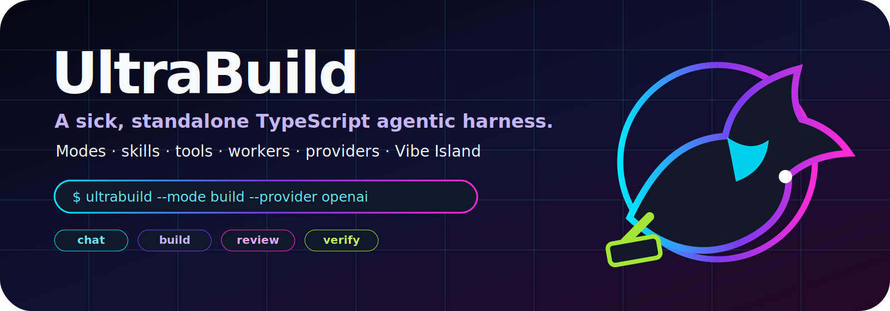
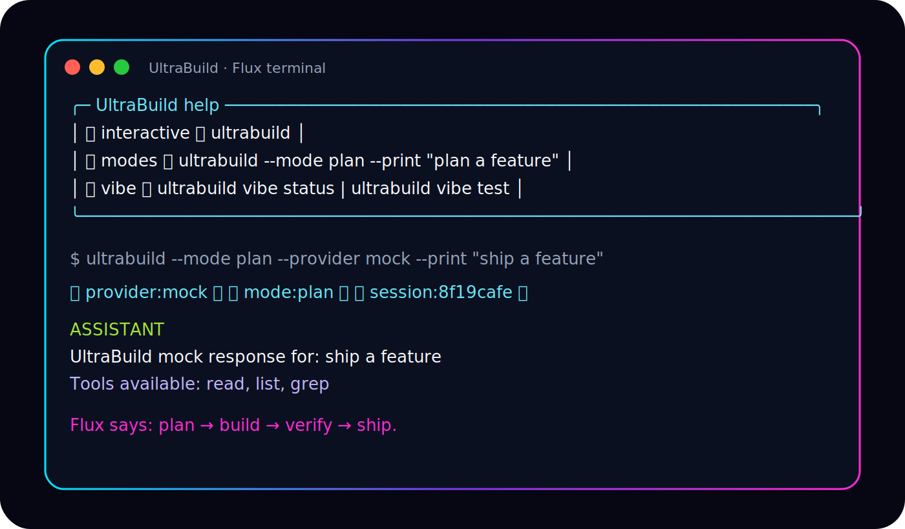

<p align="center">
  
</p>

<p align="center">
  <a href="https://github.com/VoidChecksum/UltraBuild/actions/workflows/ci.yml"></a>
  
  
  
  <a href="LICENSE"></a>
</p>

<p align="center">
  
</p>

# UltraBuild

**UltraBuild** is a standalone TypeScript/Node agentic harness for developers who want provider freedom, workflow discipline, portable tools, releaseable bundles, and a terminal UX that feels alive.

> Build with every model. Ship with every agent. Control every tool.

UltraBuild borrows the best lessons from Pi CLI, Claude Code + Superpowers, Oh-My-Codex, Kimi Code, Codex CLI, Gemini CLI, OpenCode, Crush, Aider, Goose, and friends — then keeps the core small enough to understand.

<p align="center">
  
</p>

Meet **Flux**, the UltraBuild forge-dragon: fast, friendly, slightly dangerous around unreviewed shell commands.

<p align="center"></p>

---

## What works now

UltraBuild v0.1 is an actual MVP, not a landing page:

- interactive CLI and `--print` one-shot mode
- explicit modes: `chat`, `build`, `plan`, `review`, `debug`, `workers`, `yolo`
- OpenAI-compatible provider
- Anthropic provider
- deterministic mock provider for offline demos and tests
- JSONL sessions
- tools: `read`, `write`, `edit`, `bash`, `list`, `grep`
- approvals for write/edit/bash with visible `yolo` auto-approval mode
- markdown skills
- simple worker spawning
- Vibe Island event compatibility
- cross-platform `doctor`
- E2E and release bundle smoke tests
- official bundle matrix for Linux/macOS/Windows x64/arm64

## Quickstart from source

```bash
git clone https://github.com/VoidChecksum/UltraBuild.git
cd UltraBuild
npm install
npm run build
node dist/cli.js doctor
node dist/cli.js --provider mock --print "hello UltraBuild"
```

Interactive mode:

```bash
node dist/cli.js
```

One-shot plan mode:

```bash
node dist/cli.js --mode plan --provider mock --print "plan a safe refactor"
```

Workers:

```bash
node dist/cli.js workers --count 2 --provider mock "summarize this repository"
```

## Release bundles

UltraBuild produces portable Node bundles with `dist/`, docs/assets, and launchers:

| Target | Artifact |
| --- | --- |
| Linux x64 | `ultrabuild-linux-x64.tar.gz` |
| Linux arm64 | `ultrabuild-linux-arm64.tar.gz` |
| macOS x64 | `ultrabuild-macos-x64.tar.gz` |
| macOS arm64 | `ultrabuild-macos-arm64.tar.gz` |
| Windows x64 | `ultrabuild-windows-x64.zip` |
| Windows arm64 | `ultrabuild-windows-arm64.zip` |

Build all bundles locally:

```bash
npm run package:all
npm run smoke:release
```

Use a bundle:

```bash
# Linux/macOS
tar -xzf ultrabuild-linux-x64.tar.gz
./ultrabuild-linux-x64/bin/ultrabuild doctor

# Windows PowerShell
Expand-Archive ultrabuild-windows-x64.zip
.\ultrabuild-windows-x64\bin\ultrabuild.cmd doctor
```

See [docs/RELEASES.md](docs/RELEASES.md).

## Modes

Modes change the system prompt, tool availability, approvals, and status metadata.

| Mode | Use it for | Tool posture |
| --- | --- | --- |
| `chat` | general help and light repo questions | all tools behind approvals |
| `build` | implementation | all tools behind approvals |
| `plan` | design/research/specs | read/list/grep only |
| `review` | code review | read/list/grep only |
| `debug` | evidence-first bug fixing | all tools behind approvals |
| `workers` | multi-worker summaries | worker orchestration |
| `yolo` | trusted automation | auto-approves write/edit/bash; visibly dangerous |

```bash
ultrabuild --mode review --print "review this branch"
ultrabuild --mode yolo --print "run the trusted release checklist"
```

Interactive slash commands:

```text
/help
/theme
/doctor
/skills
/workers 3 compare provider adapters
/mode plan
/exit
```

## Vibe Island compatibility

UltraBuild can report session and tool events to [`VoidChecksum/vibe-island`](https://github.com/VoidChecksum/vibe-island).

```bash
ultrabuild vibe status
ultrabuild vibe test
ultrabuild --no-vibe --print "run without island events"
```

Transport is best-effort and non-blocking:

- Unix: `~/.vibe-island/run/vibe-island.sock`, fallback `/tmp/vibe-island.sock`
- Windows: `\\.\\pipe\\vibe-island`
- event source: `_source: "ultrabuild"`

UltraBuild emits session start, prompt, tool, approval, stop, and session-end style events in Vibe Island's hook-event JSON shape.

## Configure real providers

UltraBuild creates `~/.ultrabuild/config.json` on first run.

OpenAI-compatible:

```bash
export OPENAI_API_KEY="sk-..."
ultrabuild --provider openai --print "review this repo"
```

Anthropic:

```bash
export ANTHROPIC_API_KEY="sk-ant-..."
ultrabuild --provider anthropic --print "plan a refactor"
```

`ULTRABUILD_HOME` overrides the config/session directory.

## Commands

| Command | Purpose |
| --- | --- |
| `ultrabuild` | Interactive prompt |
| `ultrabuild --print "prompt"` | One-shot agent turn |
| `ultrabuild --mode <mode>` | Select mode |
| `ultrabuild doctor` | Check Node, platform, config, workspace, Vibe Island status |
| `ultrabuild init` | Create default config |
| `ultrabuild workers --count 3 "task"` | Spawn mock worker summaries |
| `ultrabuild vibe status` | Check Vibe Island IPC reachability |
| `ultrabuild vibe test` | Send a test Vibe Island event |

## Safety model

UltraBuild is an agentic harness. It can write files and run commands when you let it.

Defaults:

- read/list/grep are allowed
- write/edit/bash require approval
- `plan` and `review` are read-only
- `--yes` auto-approves for automation
- `yolo` auto-approves and is intentionally obvious
- dangerous shell patterns are flagged
- sessions log prompts, assistant output, tool calls, and approval decisions

## Architecture

```text
UltraBuild CLI
├─ command router: interactive, print, doctor, init, workers, vibe
├─ UI: dependency-light ANSI neon renderer
├─ modes: chat/build/plan/review/debug/workers/yolo
├─ core runtime: config, sessions, providers, tools, skills, approvals
├─ providers: mock, OpenAI-compatible, Anthropic, future OAuth adapters
├─ tools: read, write, edit, bash, list, grep
├─ integrations: Vibe Island socket/named-pipe events
├─ release: OS/arch bundles + smoke tests
└─ workers: child/log based orchestration primitive
```

See [docs/ARCHITECTURE.md](docs/ARCHITECTURE.md).

## Development

```bash
npm install
npm test
npm run e2e
npm run package:all
npm run smoke:release
```

## Roadmap

- v0.2: native tool calling, MCP, richer worker orchestration
- v0.3: full-screen TUI, model switching, session resume/tree
- v0.4: LSP context, git worktree worker isolation, review gates
- v0.5: ACP/IDE adapters, OAuth adapter plugins, package marketplace
- later: native single-file binaries, signing/notarization, richer sandboxing

## License

MIT

<p align="center">
  
</p>
